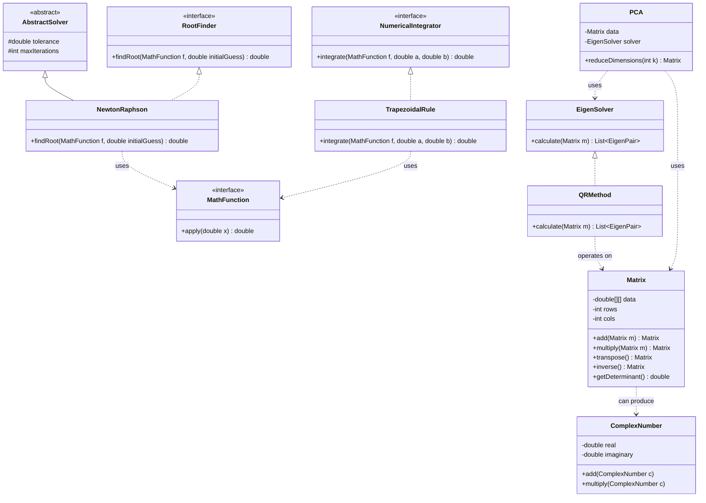
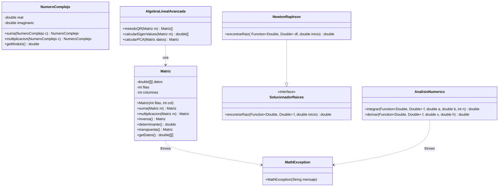

- [ ] MATRIX OPERATIONS
- [ ] Newthon Rephson
- [ ] Numerical Integration and derivation

Prueba a ver como se ve el diatram `UML`

```mermaid
classDiagram
    %% Core Types
    class Matrix {
        -double[][] data
        -int rows
        -int cols
        +add(Matrix m) Matrix
        +multiply(Matrix m) Matrix
        +transpose() Matrix
        +inverse() Matrix
        +getDeterminant() double
    }

    class ComplexNumber {
        -double real
        -double imaginary
        +add(ComplexNumber c)
        +multiply(ComplexNumber c)
    }

    %% Functional Interfaces (First-class citizens focus)
    class MathFunction {
        <<interface>>
        +apply(double x) double
    }

    %% Numerical Analysis Hierarchies
    class RootFinder {
        <<interface>>
        +findRoot(MathFunction f, double initialGuess) double
    }

    class AbstractSolver {
        <<abstract>>
        #double tolerance
        #int maxIterations
    }

    class NewtonRaphson {
        +findRoot(MathFunction f, double initialGuess) double
    }

    class NumericalIntegrator {
        <<interface>>
        +integrate(MathFunction f, double a, double b) double
    }

    class TrapezoidalRule {
        +integrate(MathFunction f, double a, double b) double
    }

    %% Linear Algebra & PCA
    class EigenSolver {
        +calculate(Matrix m) List~EigenPair~
    }
    
    class QRMethod {
        +calculate(Matrix m) List~EigenPair~
    }

    class PCA {
        -Matrix data
        -EigenSolver solver
        +reduceDimensions(int k) Matrix
    }

    %% Relationships
    AbstractSolver <|-- NewtonRaphson
    RootFinder <|.. NewtonRaphson
    NumericalIntegrator <|.. TrapezoidalRule
    NewtonRaphson ..> MathFunction : uses
    TrapezoidalRule ..> MathFunction : uses
    
    EigenSolver <|.. QRMethod
    QRMethod ..> Matrix : operates on
    PCA ..> Matrix : uses
    PCA ..> EigenSolver : uses
    Matrix ..> ComplexNumber : can produce
```

Este es otro que da el diagram `UML`

```mermaid
classDiagram
    class Matriz {
        -double[][] datos
        -int filas
        -int columnas
        +Matriz(int filas, int col)
        +suma(Matriz m) Matriz
        +multiplicacion(Matriz m) Matriz
        +inversa() Matriz
        +determinante() double
        +transpuesta() Matriz
        +getDatos() double[][]
    }

    class NumeroComplejo {
        -double real
        -double imaginario
        +suma(NumeroComplejo c) NumeroComplejo
        +multiplicacion(NumeroComplejo c) NumeroComplejo
        +getModulo() double
    }

    class SolucionadorRaices {
        <<Interface>>
        +encontrarRaiz(Function~Double, Double~ f, double inicio) double
    }

    class NewtonRaphson {
        +encontrarRaiz(Function~Double, Double~ f, Function~Double, Double~ df, double inicio) double
    }

    class AnalisisNumerico {
        +integrar(Function~Double, Double~ f, double a, double b, int n) double
        +derivar(Function~Double, Double~ f, double x, double h) double
    }

    class AlgebraLinealAvanzada {
        +metodoQR(Matriz m) Matriz[]
        +calcularEigenValues(Matriz m) double[]
        +calcularPCA(Matriz datos) Matriz
    }

    class MathException {
        +MathException(String mensaje)
    }

    Matriz ..> MathException : throws
    NewtonRaphson ..|> SolucionadorRaices
    AlgebraLinealAvanzada ..> Matriz : usa
    AnalisisNumerico ..> MathException : throws
```